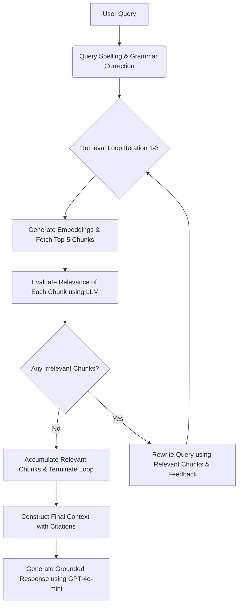

# Lexora AI - Viva Preparation Sheet

Use this comprehensive sheet to prepare for project reviews, viva voce, or oral examinations.

---

## 🎯 1. Project Overview & Objectives
* **What is Lexora AI?** 
  Lexora AI is an enterprise-grade document intelligence platform that allows users to upload documents (PDFs, text files), parse and index them, and chat with them in a grounded, hallucination-free manner using Retrieval-Augmented Generation (RAG).
* **Key Features:**
  - Multi-page PDF parsing and chunking.
  - Page-level citation linking (e.g., `[Page 4]`).
  - Strict context grounding (no outside knowledge extrapolation).
  - Modern Glassmorphic dark UI.
  - Corrective Retrieval-Augmented Generation (CRAG) pipeline.

---

## 🛠️ 2. Tech Stack & Architecture
* **Frontend:** Next.js 15 (App Router), React 19, Tailwind CSS v4, Framer Motion (for sleek animations), Lucide React (icons).
* **Backend:** Next.js Server Actions & API Routes (running on Node.js environment).
* **ORM:** Prisma ORM.
* **Database:** PostgreSQL (hosted on Neon for serverless capability).
* **Vector Database:** Qdrant (runs locally in Docker or via Qdrant Cloud).
* **Embeddings Model:** `gemini-embedding-001` (3072-dimensional vector output).
* **LLM Engine:** OpenRouter API (`openai/gpt-4o-mini`).

---

## 🧬 3. The RAG to Corrective RAG (CRAG) Transition
In a naive RAG pipeline, the system fetches document chunks based on query embeddings and feeds them directly to the LLM. If the retrieval step fetches irrelevant chunks, the model generates incorrect or generic answers (or fails to answer).

Lexora AI solves this by employing **Corrective RAG (CRAG)**:

### Key CRAG Components implemented in Lexora AI:
1. **Query Typo Correction (`correctQuery`):**
   Right after the user submits a query, an LLM checks for spelling/grammatical issues (e.g., `"wat is the main topc"` $\rightarrow$ `"What is the main topic?"`) to improve vector matching accuracy.
2. **Chunk Relevancy Verification (`checkRelevance`):**
   Each retrieved chunk is evaluated by an LLM as a binary classification (`yes`/`no`) against the corrected query.
3. **Recursive Query Rewriting (`rewriteQuery`):**
   If any chunk is irrelevant, the system uses the relevant chunks accumulated so far and the irrelevant chunks as negative constraints to rewrite a more precise search query. It then loops back to query the vector database again (up to 3 times maximum to balance accuracy and latency).

---

## 📊 4. Database Schema (Prisma Models)
* **`User`**: Tracks user accounts and authentication.
* **`Document`**: Stores metadata (title, filename, mimetype) and the raw extracted text content of uploaded documents.
* **`Chat`**: Links a user session to a specific document.
* **`Message`**: Stores chat history, message role (`user` / `assistant`), raw content, and generated page-level `citations` as JSON payloads.

---

## 🎓 5. High-Probability Viva Questions & Answers

### Q1: What is a Vector Embedding and why do we need it?
**Answer:** A vector embedding is a numerical representation of text (words, sentences, or paragraphs) in a high-dimensional space where words/phrases with similar semantic meaning are physically closer to each other. We use it to perform **semantic searches** rather than simple keyword matches.

### Q2: Why did we choose Qdrant as the Vector Database?
**Answer:** Qdrant is an open-source, high-performance vector search engine written in Rust. It offers rapid similarity searches (Cosine distance, Dot product, or Euclidean distance), allows payload filtering (like filtering chunks by `documentId` on the fly), and provides a clean REST/gRPC API.

### Q3: What is the benefit of CRAG over normal RAG?
**Answer:** Naive RAG is "blind" to the quality of retrieved documents. CRAG introduces a self-correction mechanism: it evaluates the retrieved results, filters out noise, and dynamically modifies the search query if the vector database returned irrelevant or off-topic information.

### Q4: How do you handle LLM hallucination?
**Answer:** We enforce a strict system prompt instructing the LLM to only answer using the provided context. If the answer is not present, it must say: `"This information is not available in the uploaded document."` Additionally, the CRAG check ensures that irrelevant or distracting information is filtered out before it reaches the generation context.

### Q5: How is the page-level citation mapping implemented?
**Answer:** During the PDF upload stage, the file is parsed page-by-page. When chunking, each chunk retains its source page number in its metadata payload (`pageNumber`). When chunks are retrieved and validated by the CRAG pipeline, their page numbers are returned along with the final answer to generate clickable citation tags.
